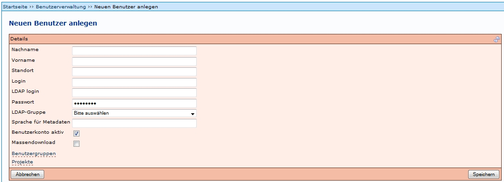

# Einleitung

Benutzer können von Administratoren angelegt werden. Dies ist möglich unter dem Menüpunkt Benutzer. Die Einstiegsseite bietet eine Übersichtstabelle über bereits vorhandene Benutzer (die Benutzernamen wurden im Beispiel entfernt).

Tipp:

Wahlweise kann man sich auch nur *aktive Nutzer* anzeigen lassen, indem das Häkchen in das entsprechende Feld rechts oberhalb der Tabelle gesetzt wird.
Der *Filter* ermöglicht die Suche nach den Namen (Vor- und/oder Nachnamen) der Benutzer.
Über den Link *Neuen Benutzer anlegen* öffnet sich ein neues Fenster zum Anlegen eines neuen Benutzers (Beschreibung siehe unten).
 

Die letzte Spalte der Übersichtstabelle bietet eine Auswahl folgender Aktionen:

| Symbol | Aktion | Beschreibung | 
| ------------- | ------------- | ----- |
|  | Benutzer bearbeiten | Es öffnet sich ein Formular, in dem die Angaben der Benutzer bearbeitet werden können. Das Formular ist identisch mit dem zum Anlegen eines neuen Benutzers. |
|  | Benutzerprofil laden | Das aktuelle Benutzerprofil wird geändert, der Administrator nimmt die Rolle des ausgewählten Benutzers an. Das ermöglicht ihm bspw. die Simulation unterschiedlicher Einsatzszenarien oder kann bei der Fehlersuche hilfreich sein. |

# Benutzer bearbeiten

Benutzereinstellungen können jederzeit bearbeitet werden. Dazu gehören unter anderem die Zuweisung neuer Projekte und die Zuweisung neuer Benutzergruppen. Der Ablauf ähnelt dem des Anlegen neuer Benutzer, weshalb auf den folgenden Abschnitt verwiesen wird.

# Neuen Benutzer anlegen

Wird ein neuer Benutzer über den Link *Neuen Benutzer anlegen* angelegt, müssen einige Felder ausgefüllt, bzw. geändert werden. Es folgt eine Beschreibung der auszufüllenden Felder.

| Details       | Beschreibung  |
| ------------- | ------------- |
| Nachname | Realer Nachname des Benutzers | 
| Vorname | Realer Vorname des Benutzers | 
| Standort | Ort, an dem die Tätigkeit ausgeführt wird | 
| Login | Name für die Benutzeranmeldung |
| LDAP login | ??? |
| Passwort | Passwort für den Benutzeranmeldung, sollte vom Benutzer nach der Erstanmeldung selbst geändert werden, siehe Passwort ändern |
| LDAP-Gruppe | Auswahl der entsprechenden LDAP-Gruppe(n) - Voraussetzung: Anlegen der LDAP-Gruppen. Wenn in der Konfigurationsdatei Konfiguration.properties die LDAP-Option ausgeschaltet wurde, muss hier keine Auswahl erfolgen. |
| Sprache für Metadaten | Die maßgebliche Sprache für die Metadaten - Voraussetzung: Die Sprache muss in der Metadatenkonfiguration definiert sein. Von der Konfiguration leitet sich ebenfalls ab, was an dieser Stelle eingetragen werden kann (meist ist ‚de’ eine gute Lösung). Diese Einstellung bestimmt die Sprache in der die Felder im Metadateneditor angezeigt werden. |
| Benutzerkonto aktiv | Gibt an, ob der Benutzer aktiv ist, d.h aktuell im System arbeiten darf, oder nicht. Das Deaktivieren von Benutzern eignet sich für Personen, die nicht (mehr) im System arbeiten (z.B. Mitarbeiter abgeschlossener Projekte), deren Daten aber noch vorgehalten werden sollen. |
| Massendownload | Mit dieser Berechtigung ist ein Benutzer in der Lage, mehrere Vorgänge gleichzeitig zu übernehmen und zu bearbeiten, was bspw. bei der Imagenachbearbeitung (Stapelverarbeitung von Titeln etc.) von Vorteil sein kann. |
| Benutzergruppen | Per Mausklick auf den Link öffnet sich ein Fenster mit den aktuell verfügbaren Benutzergruppen - Voraussetzung: [Anlegen der gewünschten Benutzergruppen](Bearbeitung-Benutzergruppen). Durch Klick auf den Button *Übernehmen*  wird die betreffende Benutzergruppe dem Benutzer zugewiesen; es können mehrere Benutzergruppen in einem Zuge gewählt werden. Übernommen werden diese Benutzergruppen erst nach dem Schließen des externen Fensters über den Link 'schließen’. |
| Projekte | Per Mausklick auf den Link öffnet sich ein Fenster mit den aktuell verfügbaren Projekten - Voraussetzung: [Anlegen der gewünschten Projekte](Bearbeitung-Projekte). Durch Klick auf den Button *Übernehmen*  wird das betreffende Projekt dem Benutzer zugewiesen; es können mehrere Projekte in einem Zuge ausgewählt werden. Übernommen werden diese Projekte erst nach dem Schließen des externen Fensters über den Link 'schließen’. |

