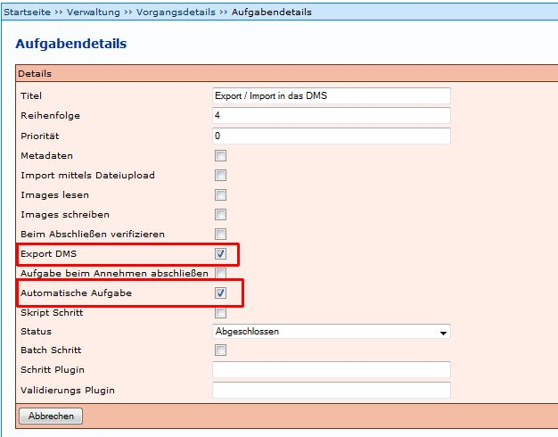
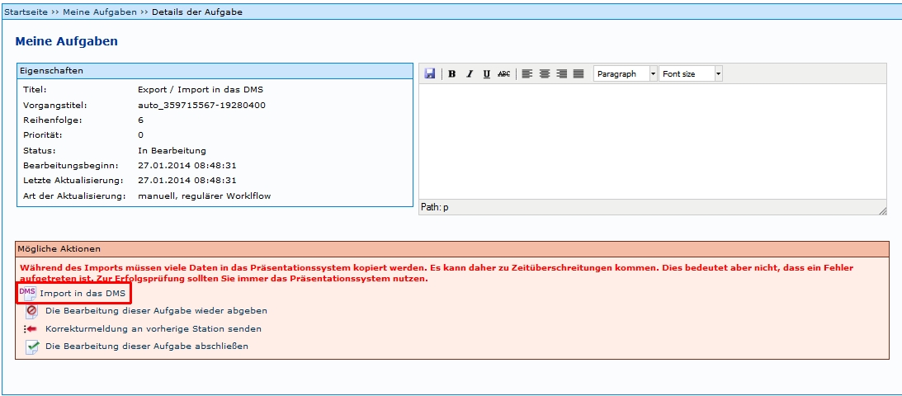
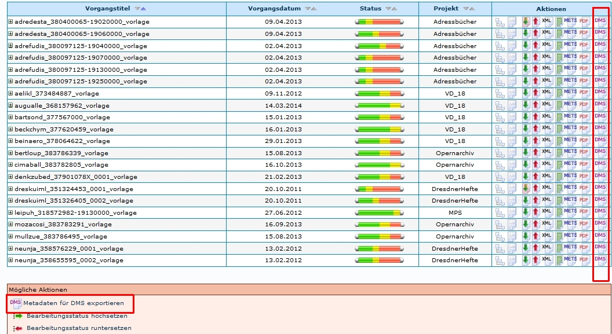
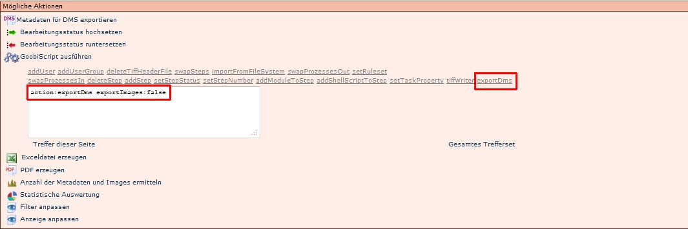

# Einleitung

Durch den Export wird ein Vorgang (Images und die Meta- und Strukturdaten) in die jeweilige Präsentation exportiert. Es gibt unterschiedliche Möglichkeiten, wie der Export ausgelöst werden kann: 

* Automatischer Export
* Manueller Export
* Administrativer Export

# Automatischer Export

Der automatische Export wird ausgelöst, wenn die vorige Aufgabe abgeschlossen worden ist. Der Prozess wird im Hintergrund ausgeführt.

Um den automatischen Export zu aktivieren, müssen zwei Vorraussetzungen erfüllt werden:

1. Einstellungen in dem jeweiligen Projekt
1. Einstellungen in dem Export-Schritt von Vorgängen, bzw. in der jeweiligen Produktionsvorlage 

## Projekteinstellungen

In den Projekteinstellungen müssen unter *Technische Daten* folgende Einstellungen vorgenommen werden: 

* bei *Automatischer DMS-Export* ein Haken gesetzt werden
* bei *Erzeuge Vorgangsordner* ein Haken gesetzt werden 
* bei *DMS-Export-Ordner für XML-Datei* der entsprechende Pfad eingetragen werden
* bei *DMS-Export-Images-Ordner* der entsprechende Pfad eingetragen werden

## Einstellungen Export-Schritt 

Es müssen auch in dem Export-Schritt jedes Vorgangs Einstellungen vorgenommen werden. Dies sollte, wenn möglich unbedingt beim Erstellen der Produktionsvorlage berücksichtigt werden, so dass die Einstellungen beim Anlegen der Vorgänge automatisch übernommen werden.

In den Aufgabendetails des Export-Schrittes müssen Haken gesetzt sein bei: 

* *Export DMS*
* *Automatische Aufgabe*

 
# Manueller Export

Der Export lässt sich nur mit ausreichenden administrativen Rechten durchführen. Der Benutzer muss zudem der Benutzergruppe *Import DMS* zugewiesen sein.

Ein Vorgang, der exportiert werden soll, kann über die Liste *Meine Aufgaben* über *Aktionen* ausgewählt werden und es wird folgendes Fenster angezeigt.

Der Befehl *Import in das DMS* löst den Export aus. Dieser wird jedoch nicht, wie beim automatischen Export im Hintergrund ausgeführt, so dass während des Exports **keine anderen Aufgaben** in Kitodo.Production bearbeitet werden können. Je nach Umfang des Vorgangs, kann dies  längere Zeit dauern. Nach erfolgetem Export muss die Aufgabe abgeschlossen werden, so dass der Status der Aufgabe auf grün gesetzt wird und die darauf folgende Aufgabe bearbeitet werden kann.

Zudem kann der Export bei Trefferlisten in der Verwaltung (Nach einem Vorgang suchen) ausgelöst werden:

Bei der Anwendung von *Metadaten für DMS exportieren* ist unbedingt darauf zu achten, dass sich der Befehl auf die Trefferliste bezieht! Über das Symbol DMS  lässt sich ein einzelner Vorgang exportieren.

**ACHTUNG**: Wenn der Benutzer nicht für den Export in das DMS eingerichtet ist, wird der Vorgang nur in das [Homeverzeichnis](https://github.com/kitodo/kitodo-production/wiki/Homeverzeichnis) des Nutzers exportiert. Dieser Weg sollte nur in Ausnahmefällen gewählt werden!

# Administrativer Export / Export ohne Images

Es gibt noch eine weitere Möglichkeit, einen Export durchzuführen, nämlich über das [GoobiScript](https://github.com/kitodo/kitodo-production/wiki/GoobiScript) *exportDms*.

Wenn diese Funktion ausgewählt wird, wird in dem Eingabefeld der Befehl *action:exportDms* *exportImages:false* angezeigt. Dies bedeutet, dass die Images **nicht** exportiert werden, so dass die Funktion verwendet werden kann, wenn nur die Metadaten (zum Beispiel nach Korrekturen) exportiert werden sollen.

Die Funktion wird mit den Befehlen *Treffer dieser Seite*, beziehungsweise *Gesamtes Trefferset* ausgelöst. Hier ist zu beachten, dass die Ergebnisliste nur die Vorgänge enthält, die auch tatsächlich exportiert werden sollen.

Wird in dem Eingabefeld der Befehl *action:exportDms exportImages:**false*** zu *action:exportDms exportImages:**true*** geändert, werden auch die Images exportiert. Wie beim manuellen Export wird dies nicht im Hintergrund durchgeführt, so dass während des Exports keine andere Aufgabe in Kitodo.Production durchgeführt werden können. Dieser Export sollte nur im "Notfall verwendet werden".

 
