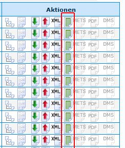

# Einleitung
In Kitodo.Production besteht die Möglichkeit, nach dem Anlegen eines [Vorgangs](https://github.com/kitodo/kitodo-production/wiki/Vorgang) einen Laufzettel zu erstellen, der die wichtigsten Informationen eines Vorgangs (Vorgangstitel, Signatur, ...) beinhaltet.

# Laufzettel drucken 
Es gibt zwei Möglichkeiten, den Druck von Laufzetteln in Kitodo.Production auszulösen. Zum einen nach dem Anlegen eines Vorgangs (siehe: [Weiteren Vorgang anlegen](https://github.com/kitodo/kitodo-production/wiki/Neuen-Vorgang-anlegen#weiteren-vorgang-anlegen)). Zum anderen kann in der Trefferliste von _Vorgang suchen_ unter _Aktionen_ ein Laufzettel jedes angezeigten Vorgangs aufgerufen werden. 

# Konfiguration
Das Layout oder die Inhalte des Laufzettels kann in Kitodo.Production jedoch nicht bearbeitet werden. Die Laufzettelvorlagen werden im Hintergrund gespeichert und können in Kitodo.Production unter dem Menüpunkt Laufzettel angezeigt werden:

Beim Anlegen eines neuen Laufzettels kann in Kitodo.Production nur dessen Benennung gewählt werden. In das zweite Feld wird der Name der Datei des Laufzettels (docket.xsl) eingetragen, die in einem bestimmten Ordner im Kitodo-Verzeichnis liegen muss. Änderungen am Aufbau und Aussehen des Laufzettels müssen in dieser Datei durchgeführt werden. Unter [Anpassungen in der docket.xsl](https://github.com/kitodo/kitodo-production/wiki/Anpassungen-in-der-docket.xsl) wurde eine Anleitung erstellt, welche Daten aus Kitodo genutzt werden können und wie diese konfiguriert werden. 

Nach der [Installationsanleitung](https://github.com/kitodo/kitodo-production/wiki/Installationsanleitung-f%C3%BCr-Kitodo.Production-1.10) befindet sich die Datei (oder die Dateien) in dem in *goobi_config.properties* angegebene *xsltFolder*. 
Eine Beispiel-Datei findet sich unter: [https://github.com/kitodo/kitodo-production/blob/1.11.x/Goobi/config/docket.xsl](https://github.com/kitodo/kitodo-production/blob/1.11.x/Goobi/config/docket.xsl). 

In der Goobi-Mailing-Liste gibt es einen Thread zu diesem Thema: https://maillist.slub-dresden.de/pipermail/goobi-community/Week-of-Mon-20130923/000310.html. 

# Anwendungsbeispiele

Die folgenden Informationen wurden dem folgenden Listen-Thread entnommen: 
https://maillist.slub-dresden.de/pipermail/kitodo-community/2017-January/subject.html#23 

##SLUB 
In der SLUB werden folgende Felder aus den [Vorlageneigenschaften](https://github.com/kitodo/kitodo-production/wiki/Vorgangsdetails---Physische-Vorlagen) genutzt: 

* Projekt 
* PPN digital 
* Goobi Identifier 
* Anlegedatum 
* Regelsatz 
* Signatur 
* Barcode mit Vorgangstitel 

Siehe: https://maillist.slub-dresden.de/pipermail/kitodo-community/2017-January/000023.html

##Zeutschel 
Für Zeutschel sind folgende Angaben zwingend notwendig: 

* Vorgangstitel
* Goobi ID
* ID des Dokuments (PPN oder anderer Identifier)

Zudem sind folgende Aspekte zu beachten: 

* Die Angaben auf dem Laufzettel müssten sich wie bisher konfigurieren lassen.
* Die Angaben müssen sich auch als Barcode ausgeben lassen.
Beim Barcode wäre die Möglichkeit auch QR-Codes generieren
zu können einen nützliche Erweiterung.
* Der Durchgriff auf die Metadaten wäre eine nützliche,
aber keine zwingende Erweiterung."

Siehe: https://maillist.slub-dresden.de/pipermail/kitodo-community/2017-January/000026.html

##UB Mannheim
Genutzt wird bereits: 

* Name des Projekts 
* Vorgangstitel 
* Goobi Id
* Anlegedatum
* Titel
* Autor
* Erscheinungsjahr
* Signatur
* PPN (SWB Id) digital als Nummer und als Barcode, 
* Vorgangstitel als Barcode

Gewünscht ist: 

* Angaben über den Öffnungswinkel beim Scannen 
* Allgemeine Vermerke zum Scannen

Siehe: https://maillist.slub-dresden.de/pipermail/kitodo-community/2017-January/000029.html

##UB Leipzig
In der UB Leipzig werden folgende Felder aus den [Vorlageneigenschaften](https://github.com/kitodo/kitodo-production/wiki/Vorgangsdetails---Physische-Vorlagen) genutzt: 

* Projekt
* PPN analog
* Goobi Identifier
* Anlegedatum
* Regelsatz
* Signatur
* Barcode mit Vorgangstitel
