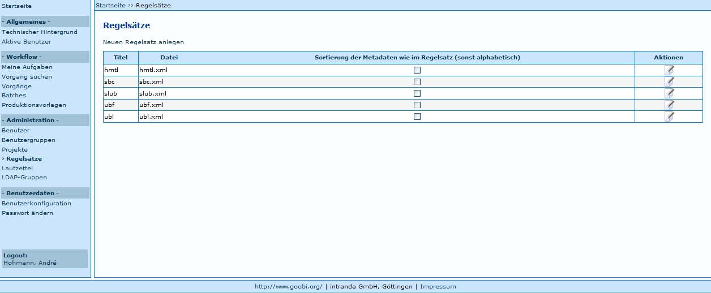
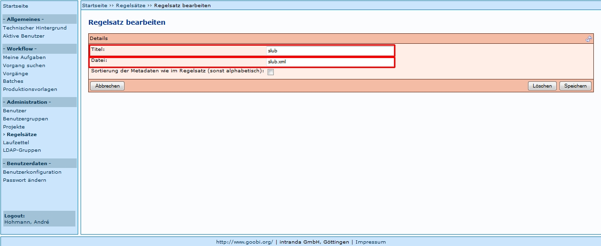
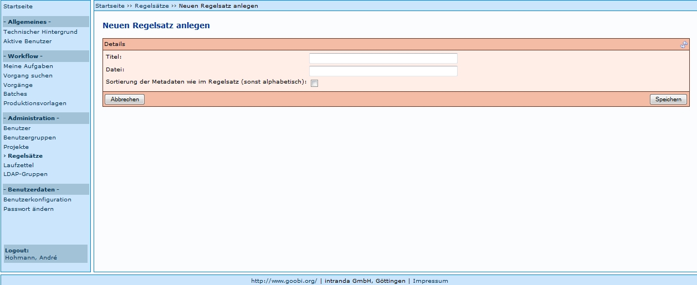

# Einleitung

In den Regelsätzen werden grundlegende Regeln hinsichtlich der Metadatennutzung einer Institution festgelegt. Da diese Regeln von jeder Institution festgelegt werden, ist es nicht möglich, eine allgemein anwendbare Regelsatzdatei bereitzustellen. Die Regelsatz der SLUB wird in diesem Wiki als Beispiel genutzt. 

# Struktur der Regelsatz-Datei

Die Regelsatz-Datei der SLUB beinhaltet drei Hauptbereiche mit weiteren die in weitere Bereiche gegliedert sind: 

*Metadaten-Bereich*

* Metadaten für die physische Dokumentstruktur
* Metadaten für die logische Dokumentstruktur
* spezifische Metadaten der SLUB

*Strukturelemente-Bereich*

* allgemeine Strukturelemente
* spezifische Strukturtypen der SLUB

*Formate-Bereich*

* RDF 
* PicaPlus 
* ZVDD METS/MODS Format

Ausführliche Informationen zur Regelsatz-Datei finden sich auf der Seite [Regelsatz XML-Datei](https://github.com/kitodo/kitodo-production/wiki/Regelsatz-XML-Datei). 

# Bearbeitung der Regelsatz-Datei

Ähnlich wie bei den Laufzetteln werden die Namen der Regelsatzdateien in Kitodo.Production zwar angezeigt, jedoch sind die Dateien im Dateiverzeichnis abgelegt. Somit kann in Kitodo.Production der Inhalt weder angesehen, noch geändert werden. 

Der Pfad für die Regelsätze lautet: /usr/local/goobi/rulesets/ (siehe [Installationsanleitung](https://github.com/kitodo/kitodo-production/wiki/Installationsanleitung-f%C3%BCr-Goobi.Production-CE-1.10))

In Kitodo.Production können nur die folgenden Aktionen durchgeführt werden:

* *Bearbeiten eines Regelsatzes*: Dies beinhaltet nur die Auswahl des Regelsatzes (durch Eingabe des Titels der Datei) und die Benennung des Regelsatzes in Kitodo.Production. 
* *Anlegen eines Regelsatzes über das Symbol* : Dies beinhaltet nur die Benennung der Regelsatze-Datei (durch Eingabe des Titels der Datei) und die Benennung des Regelsatzes in Kitodo.Production. Wenn in dem entsprechenden Verzeichnis keine Datei abgelegt ist, ist die Eingabe wirkungslos. 

*Regelsatz bearbeiten*: 

*Neuen Regelsatz anlegen*:

