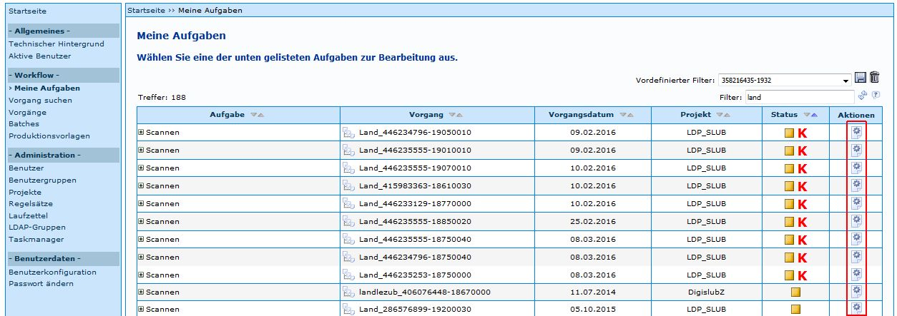
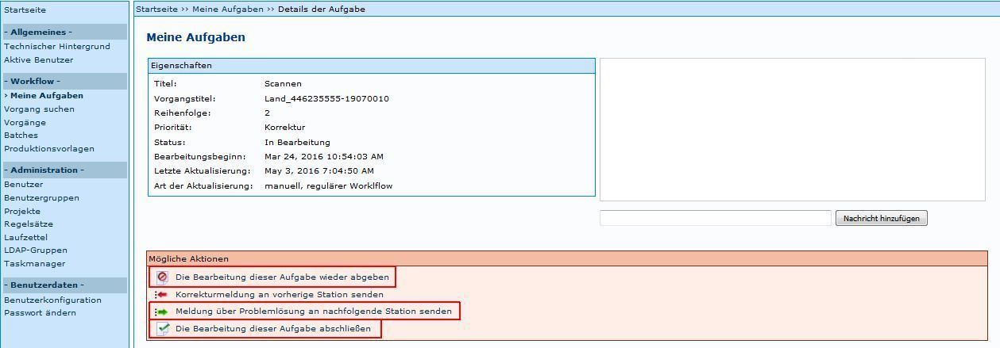

Der Arbeitsschritt Scannen folgt in der Regel nach dem [Anlegen eines Vorgangs](Neuen-Vorgang-anlegen). Kitodo.Production ist jedoch keine Software zum Scannen. Der Schritt gibt nur an, dass Images eingefügt werden sollen und dass den zur Bearbeitung vorgesehenen Benutzern die betreffenden [Vorgänge](Vorgang) als ihre Aufgabe angezeigt werden. 

Somit werden während dieses Schritts die Images mit einem Programm wie dem Windows Explorer in die jeweiligen Image-Ordner nach Kitodo.Production kopiert. Um die korrekten Image-Ordner eines Vorgangs angezeigt zu bekommen und um die Images kopieren, bzw. bearbeiten zu können, muss sich der jeweilige Benutzer in sein [Homeverzeichnis](Homeverzeichnis) verlinken.

Dies kann auf zwei Arten durchgeführt werden.

1 Meine Aufgaben

Ein Benutzer, der der [Benutzergruppe](Benutzergruppen) Scanner zugewiesen ist, sieht alle Vorgänge, die auf Scannen stehen unter meine Aufgaben. Über das Symbol in der Spalte Aktion kann die Aufgabe übernommen werden. 

Dadurch wird der Benutzer automatisch mit dem [Homeverzeichnis](Homeverzeichnis) verlinkt. Der Link wird automatisch entfernt, sobald die Aufgabe abgegeben, abgeschlossen oder eine Problemlösung gesendet wird.

2 Administrativ / Vorgang suchen

Ein Vorgang in der Trefferliste unter Vorgang suchen bietet die Möglichkeit sich ins [Homeverzeichnis](Homeverzeichnis) zu verlinken, beziehungsweise die Verlinkung zu entfernen: 

 
Im Homeverzeichnis verlinken

Verlinkung aus dem Homeverzeichnis entfernen

In der Regel müssen hier bestimmte Voreinstellungen vorgenommen werden, um diese Funktionen zu ermöglichen.  

