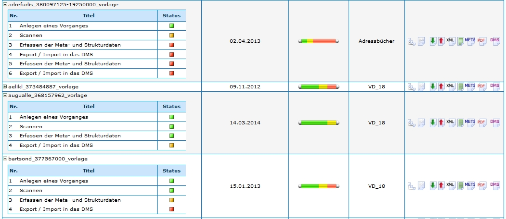

Um eine Arbeit mit vielen [Benutzern](Benutzer) zu ermöglichen, ist es wichtig, dass Aufgaben einen Status annehmen können die anzeigen, in welchem Bearbeitungsstand sich eine [Aufgabe](Aufgaben) befindet.
Dadurch lässt sich vermeiden, dass Aufgaben „vergessen“ werden, mehrere Benutzer gleichzeitig eine Aufgabe übernehmen und es wird sichergestellt, dass die vorgesehene Reihenfolge der Aufgaben eingehalten wird. 

In Kitodo.Production gibt es für jede Aufgabe vier Status der Bearbeitung. Diese sind:

* rot:		Gesperrt
* orange:	Offen
* gelb:		In Bearbeitung
* grün: 	Abgeschlossen

*Gesperrt* bedeutet, die Aufgabe ist aktuell gesperrt und gerade nicht in Bearbeitung. Die Sperre wird dann aufgehoben, sobald die Vorgängeraufgabe abgeschlossen wurde. Da die erste Aufgabe keinen Vorgänger besitzt, ist diese mindestens im Status Offen zu definieren.

*Offen* bedeutet, die Aufgabe kann durch einen zuständigen Benutzer unter *Meine Aufgaben* gefunden und bearbeitet werden.

*In Bearbeitung* bedeutet, ein Benutzer bearbeitet die Aufgabe. Für andere Benutzer ist sie dann gesperrt.

*Abgeschlossen* bedeutet, dass die Aufgabe erfolgreich bearbeitet wurde. Es kann mit der nächsten begonnen werden.

