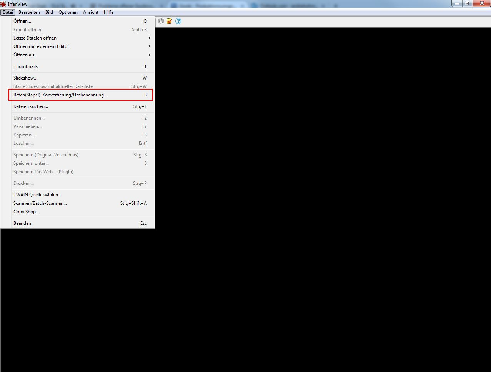
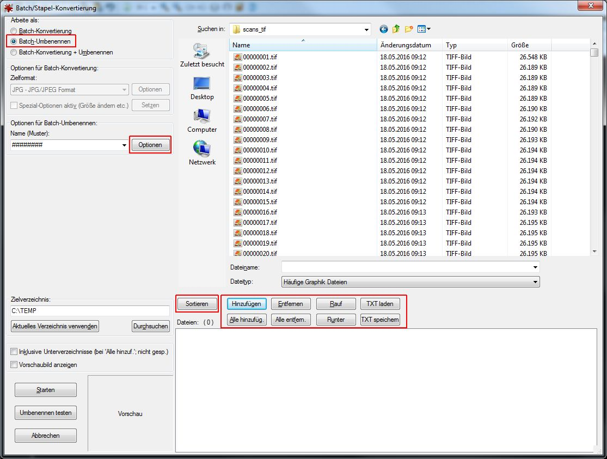
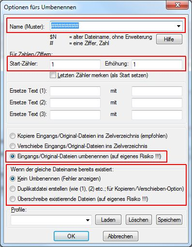
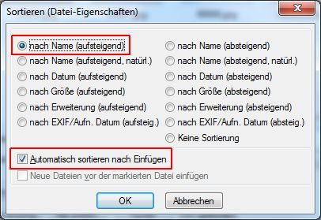
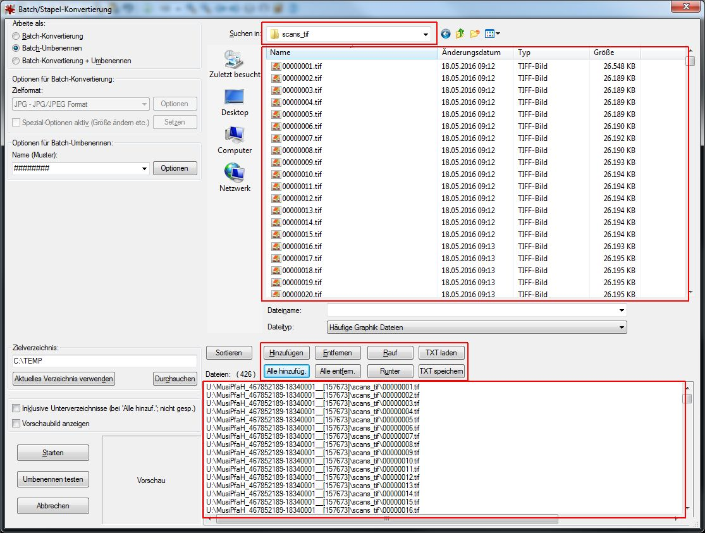
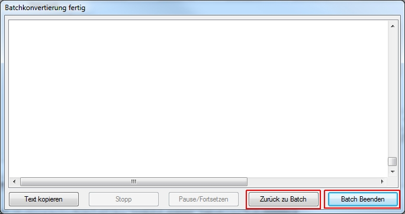
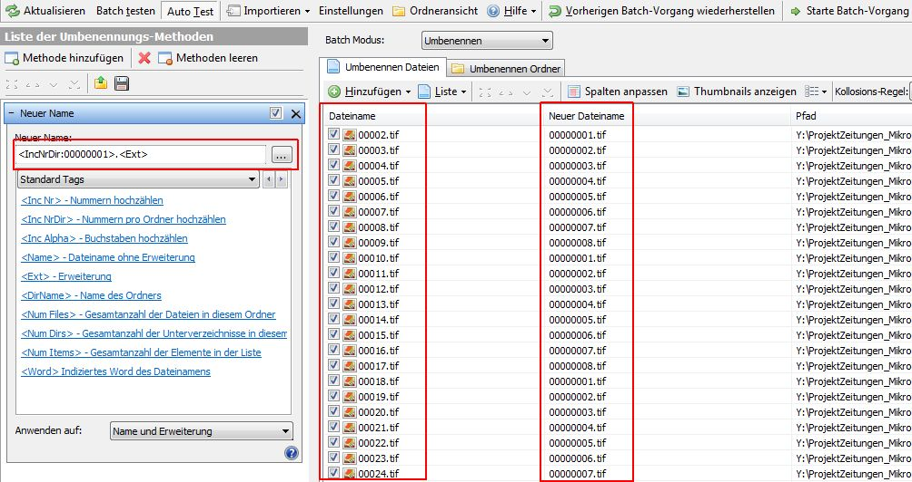
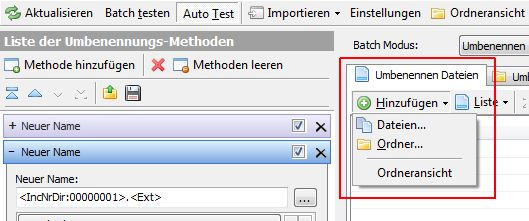
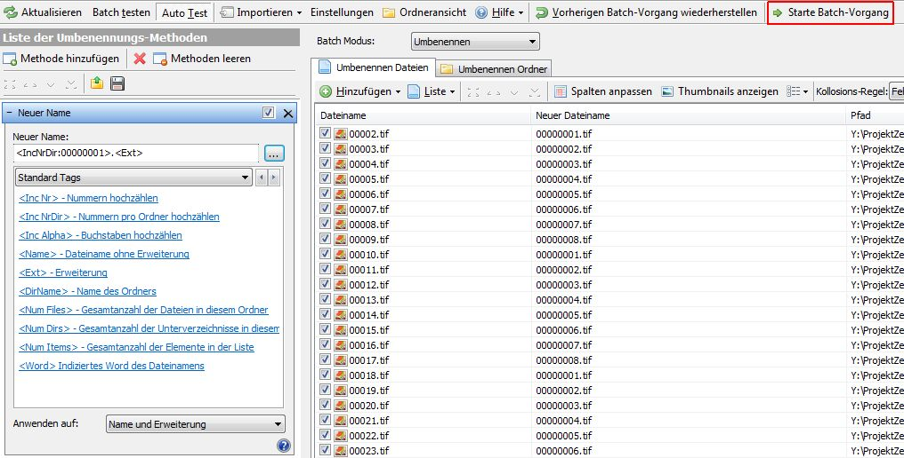

# Umbennen von Images an der SLUB 
## Einleitung

In der SLUB werden die Images eines Vorgangs nach einem bestimmten Muster benannt (acht Stellen, jeweils um eine Stelle erhöht und tif klein geschrieben): 

- 00000001.tif 

- 00000002.tif

- 00000003.tif

Auch nach Korrekturen muss diese Regel eingehalten werden. In der SLUB wird für das Batch-Umbenennen die Software IrfanView genutzt. Auf dieser Seite wird beschrieben, wie sie angewendet wird und welche Voreinstellungen vorgenommen werden müssen. 

## Umbenennen von Images in einem Ordner mit IrfanView
### Voreinstellungen

Zuerst wird die Batch-Funktion von IrfanView aufgerufen: 

Es öffnet sich ein neues Fenster, in dem Voreinstellungen vorgenommen werden müssen. 

- *Batch-Umbenennen* 
- *Optionen*
- *Sortieren*
- *Hinzufügen*, *Entfernen*, ...

*Batch-Umbenennen* auswählen 

**ACHTUNG**: ansonsten werden die Images in ein anderes Format konvertiert, das in der Auswahlbox darunter ausgewählt ist! 

*Optionen* 

Hier wird definiert, wie die Dateien benannt werden. 

- *Name (Muster)*: Die Anzahl der Rauten gibt die Anzahl der Stellen des Dateinamens an (SLUB: acht). 
- *Start-Zähler*: Hier wird die Ziffer eingetragen, die die erste Datei benennt (SLUB: eins). 
- *Erhöhung*: Hier wird die Ziffer eingetragen, um die die Benennung der Dateinamen erhöht wird (SLUB: eins). 
- *Eingangs/Original-Dateien umbenennen (auf eigenes Risiko !!!)*: Hier wird eingestellt, dass die bestehende Benennung überschrieben wird. 
- *wenn der gleiche Dateiname existiert*: Hier kann eingestellt werden, ob gleiche Dateinamen überschrieben werden. 

*Sortieren* 

 

Hier wird definiert, wie die Dateien sortiert werden. Es muss darauf geachtet werden, dass sie immer so sortiert sind, dass eine Umbenennung keine Umsortierung verursacht. In der SLUB werden die Dateien in der Regel *nach Name (aufsteigend)* sortiert. 

Zudem wird der Haken bei *Automatisch sortieren nach Einfügen* gesetzt, um ein manuelles Einstellen der Sortierung zu vermeiden. 

### Ablauf

Zunächst wird die Batch-Funktion von IrfanView aufgerufen. Es wird das zuvor beschriebene Fenster angezeigt. 

In dem Menü rechts neben *Suchen in:* wird das Laufwerk ausgewählt auf dem sich die Images befinden, die umbenannt werden sollen. In dem Fenster darunter kann man sich bis zum Ordner durchklicken, der die Images enthält. In der SLUB ist dies *scans_tif*. 

Die Dateien werden in dem oberen Fenster angezeigt. Um sie umbenennen zu können, müssen sie in dem unteren Fenster angezeigt werden. Dies wird durch die Buttons *Hinzufügen* (nur bestimmte im oberen Fenster markierte Images) und *Alle hinzufügen* (alle im oberen Fenster aufgelisteten Images) erreicht. Mit den Buttons *Entfernen*, *Alle entfernen* können Dateien wieder aus dem Fenster entfernt werden. 

Wenn alle Dateien korrekt sortiert angezeigt werden und die Voreinstellungen korrekt sind, wird mit *Starten* der Batch-Umbenennungsprozess gestartet. Es öffnet sich ein neues Fenster in dem am Ende alles Umbenennungen, und gegebenenfalls Fehler und Warnungen angezeigt werden. Das Fenster kann mit *Zurück zu Batch* oder *Batch Beenden* geschlossen werden. 
Danach kann auch der IrfanView beendet werden. 

## Umbenennen von Images in mehreren Ordnern mit Advanced Renamer

Wenn Images in mehreren Ordnern gleichzeitig jeweils ab 00000001.tif, 00000002.tif, ... benannt werden sollen, bietet sich der Advanced Renamer an. Der Befehl `<IncNrDir>` unter _Methode hinzufügen_ / _Neuer Name_ ermöglicht es, Nummern pro Ordner hochzuzählen. 

Durch die Spalten _Dateiname_, _Neuer Dateiname_ und _Pfad_ lässt sich schon vor dem Auslösen des Batchs sehr gut erkennen, ob die gewählten Einstellungen korrekt sind. 

Über _Hinzufügen_ / _Ordner_ kann der übergeordnete Ordner ausgewählt werden. Alle enthaltenen Unterordner werden bei der Anzeige der Dateien berücksichtigt. 

Mit dem Button _Starte Batch-Vorgang_ wird die Umbenennung ausgelöst. 

