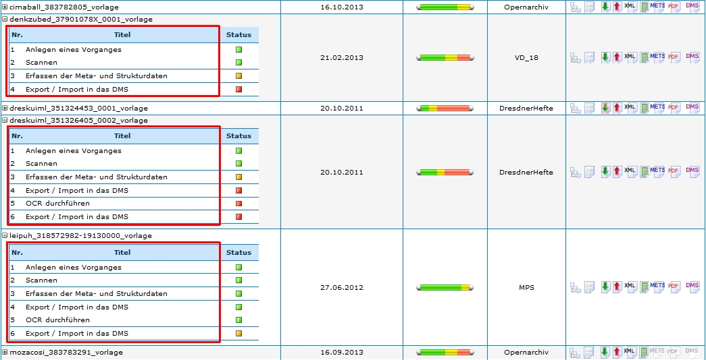

# Aufgaben
Eine wichtige Grundlage ist die Definition der Aktion, die innerhalb eines Workflows ausgeführt werden sollen. Dies wird in Kitodo.Production Aufgabe genannt und benennt zum einen die Aktion die erfüllt werden soll. Zum anderen kann über die Aufgaben auch geregelt werden, welche Benutzer bestimmte Aktionen durchführen dürfen/können. Zum Beispiel sollen bestimmte Benutzer nur für die Aufgaben Scannen zugelassen sein. 

Es können viele Aufgaben erstellt und zusammengestellt werden. Die wichtigsten sind:

* Anlegen eines Vorganges
* Scannen
* Erfassen der Meta- und Strukturdaten
* Export / Import in das DMS

Es hängt natürlich von den Projektzielen ab, welche Aufgaben benötigt werden. Es hat sich jedoch bestätigt, dass diese vier Aufgaben ausreichen, um einen Workflow zu erstellen, mit dem präsentierbare Digitalisate erstellen werden können. 

Je nach Projektziel können auch beliebige andere erstellt werden, wie zum Beispiel:

* OCR
* Qualitätskontrolle
* Nachbearbeitung

Jede Aufgabe kann einen von vier [Status](https://github.com/kitodo/kitodo-production/wiki/Status-der-Aufgaben) annehmen und muss mindestens einer [Benutzergruppe](https://intranet.slub-dresden.de/display/GOOBI/Aufgaben) zugeordnet sein. Dies ist notwendig, um die Zugriffsberechtigung für die Schritte zu ermöglichen. Weitere Informationen zur Bearbeitung, bzw. zum Erstellen von Aufgaben finden sich unter [Bearbeitung Aufgabe](https://github.com/kitodo/kitodo-production/wiki/Bearbeitung-Aufgabe).

Zum Beispiel:  

# Anwendungsfälle
## SLUB

In der SLUB werden hauptsächlich folgende Aufgaben verwendet: 

* Anlegen eines Vorganges
* Scannen
* LZA Validierung
* Erfassen der Meta- und Strukturdaten 
* OCR
* Export / Import in das DMS

OCR wird nur bei bei bestimmten Projekten verwendet. Wenn eine OCR nicht geplant ist (zum Beispiel bei Handschriften), wird die Aufgabe nicht vergeben. 

# Weitere Informationen
* Tutorial: [Produktionsvorlage anlegen und Workflow definieren](https://github.com/kitodo/kitodo-tutorials/blob/master/kitodo2/04_produktionsvorlage-anlegen-und-workflow-definieren.md)