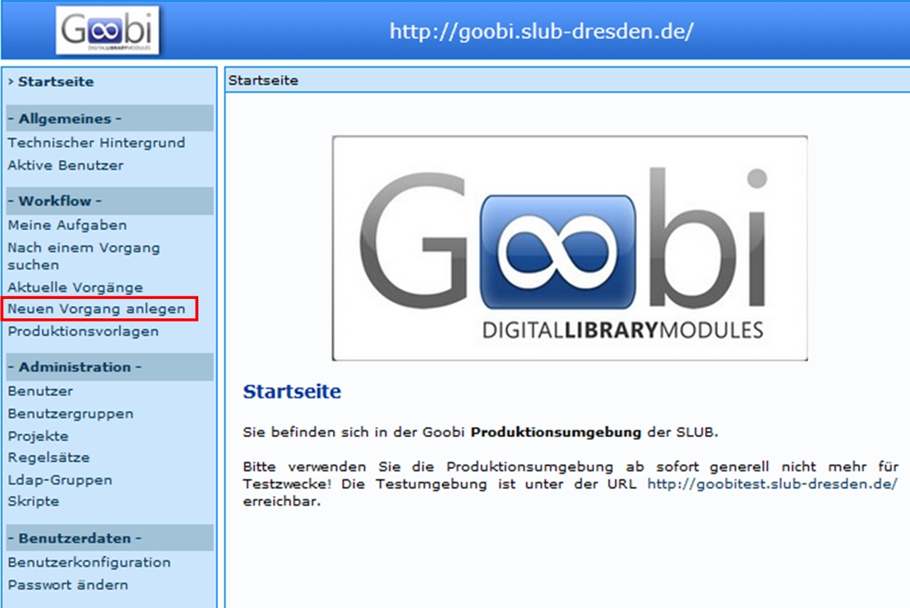
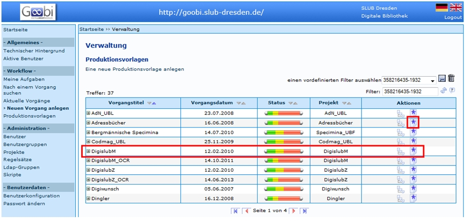
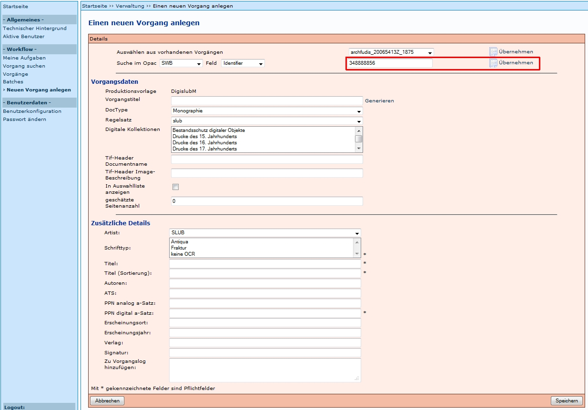
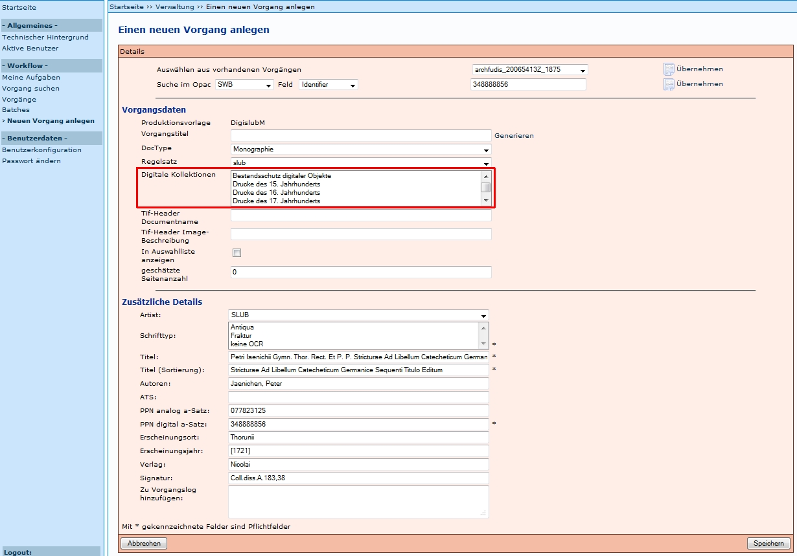
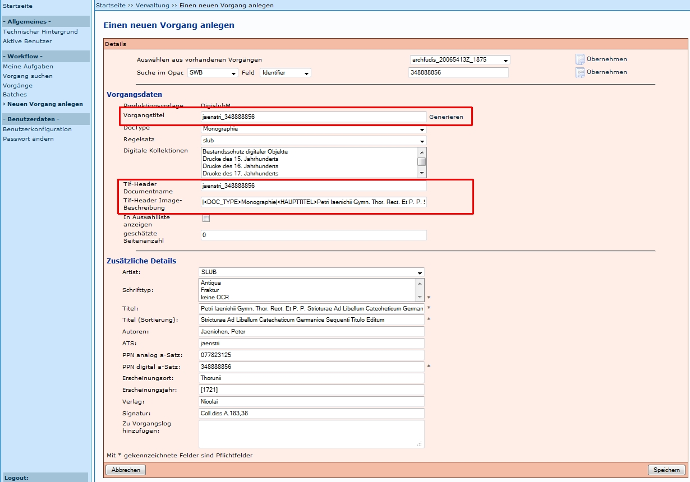
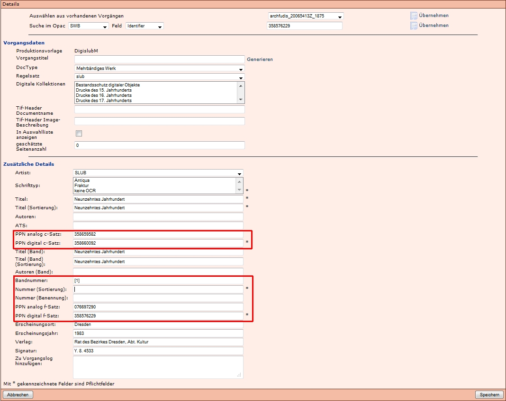
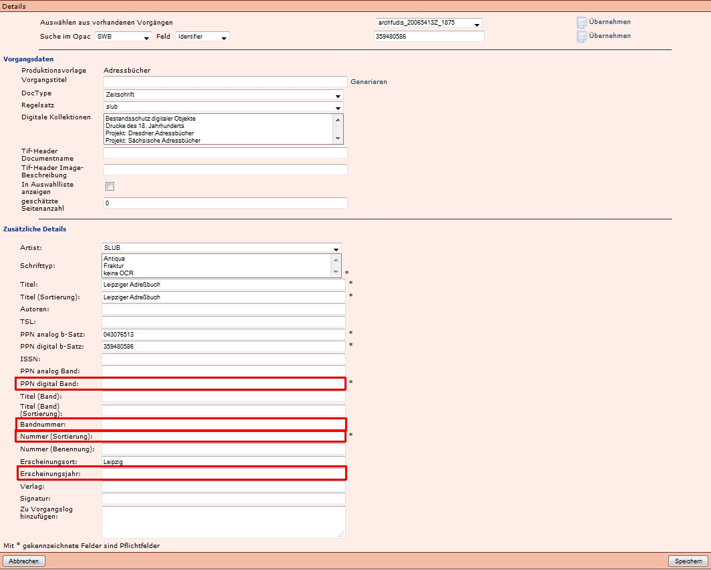
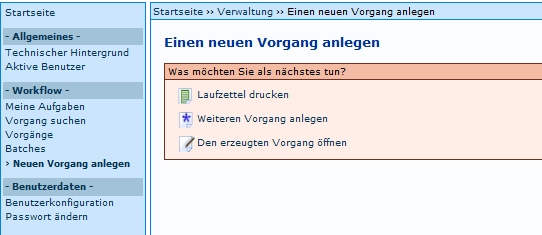

# Einleitung 

Auf dieser Seite ist der Ablauf beschrieben, der in der der SLUB durchgeführt wird. Unter [Staats und Universitätsbibliothek Hamburg Carl von Ossietzky](https://github.com/kitodo/kitodo-production/wiki/Staats--und-Universit%C3%A4tsbibliothek-Hamburg-Carl-von-Ossietzky) wird in dem Dokument [Anlegen von Vorgängen (PDF)](SUBHH_Doku_goobi/Anlegen von Vorgängen – Medienwerkstatt.pdf) der Ablauf an der SUB Hamburg beschrieben. 

# Neuen Vorgang anlegen

Um einen neuen Vorgang anlegen zu können, wird auf der Startseite der Menüpunkt _Neuen Vorgang anlegen_ ausgewählt:

# Auswahl der korrekten Produktionsvorlage

Als [Produktionsvorlagen](https://github.com/kitodo/kitodo-production/wiki/Produktionsvorlage) werden die Vorgänge bezeichnet, die als Template (Vorlage, Muster) für die Bearbeitung von Vorgangstiteln verwendet werden.

Nach Auswählen des Menüpunktes _Neuen Vorgang anlegen_ (ab Version 1.10 bei Administratoren auch _Produktionsvorlagen_), werden alle dem Nutzer verfügbaren Produktionsvorlagen aufgelistet. Aus diesen muss die Korrekte ausgewählt werden.

Ein Vorgang wird durch Auswahl des Symbols  anlegen neu angelegt und es öffnet sich eine neue Eingabemaske.

_Erfahrungen aus der Praxis:_

* Bei fehlerhafter Auswahl einer Produktionsvorlage sollte der Vorgang abgebrochen bzw. gelöscht und neu angelegt werden. 
* Änderungen des Workflows nach dem Scannen sind mit größerem Aufwand verbunden (es ist zu empfehlen, einen neuen Vorgang anzulegen, die Images dorthin zu verschieben und den falschen Vorgang zu löschen). 

# Import Metadaten aus Verbundkatalog oder anderer Datenquelle

Es öffnet sich eine Eingabemaske und es erfolgen folgende Schritte:

1. Identifier des Digitalisats (aus der Katalogdatenbank) eingeben und Übernehmen (Felder werden je nach Festlegung im Regelsatz mit den entsprechenden Metadaten gefüllt)
1. Auswahl der [digitalen Kollektion](https://github.com/kitodo/kitodo-production/wiki/Digitale-Kollektionen) und ggf. anderer, zusätzlicher Metadaten
1. Vorgangstitel generieren

Diese Schritte sind im Folgendem anhand eines Beispiels einer Monographie ausführlich beschrieben.

* Das Anlegen von Mehrbändigen Werken ist in [Neuen Vorgang anlegen I Mehrbändige Werke](https://github.com/kitodo/kitodo-production/wiki/Neuen-Vorgang-anlegen-I-Mehrb%C3%A4ndige-Werke) beschrieben. 
* Das Anlegen von Zeitungen ist in [Neuen Vorgang anlegen I Zeitungen](https://github.com/kitodo/kitodo-production/wiki/Neuen-Vorgang-anlegen-I-Zeitungen) beschrieben. 

Identifier des Digitalisats eingeben und Übernehmen anklicken.

_Erfahrungen aus der Praxis:_

Schließt man eine Eingabe in einem Feld mit der Eingabetaste (Return) ab, wird der Datensatz erneut importiert und alle eingegebenen Daten werden überschrieben (auch mit leeren Feldern). Über die Browserfunktion Zurück lässt sich dies wieder rückgängig machen und die ggf. schon eingetragenen Daten finden sich in den betreffenden Feldern.

Die eingegebene PPN wird je Session durch ein Kitodo-Feature gespeichert. Dies bedeutet, dass beim Anlegen des nächsten Vorgangs die zuvor eingegebene PPN angezeigt wird. Dies ist beim Anlegen von Zeitschriften-Bänden hilfreich, weil immer die gleiche PPN genutzt wird. Allerdings muss sie überschrieben werden, wenn die Metadaten eines anderen Titels importiert werden sollen. 

# Vervollständigen der Metadaten

Vor allem bei mehrbändigen Werken und bei Zeitschriften müssen hier Angaben ergänzt werden. Ein Pflichtfeld bei allen Medientypen ist zudem die Auswahl mindestens einer Digitalen Kollektion.

Digitale Kollektionen:

* Auswahl mindestens einer Kollektion ist Pflicht
* Auswahl mehrerer Kollektionen über STRG + Anklicken möglich

In der SLUB muss auch ein Eintrag in Schrifttyp ausgewählt werden (_Antiqua_, _Fraktur_, _keine OCR_)
# Vorgangstitel generieren

Durch _Generieren_ wird nicht nur der Vorgangstitel (ATS_PPN digital), sondern auch _Tif-Header Documentname_ und _Tif-Header Image-Beschreibung_ automatisch erzeugt.

Durch Betätigung des _Speichern_-Button wird der Vorgang mit Status Scannen angelegt und es erscheint ein neues Fenster. Zunächst wird jedoch die Eingabemaske für mehrbändige Werke und Zeitschriften erläutert, da in diesen Fällen zusätzliche Felder belegt werden müssen.

# Eingabemaske für mehrbändige Werke

Die Eingabemaske für mehrbändige Werke verfügt über zusätzliche Felder, die ausgefüllt werden, bzw. ausgefüllt werden müssen. Es handelt sich hierbei vor allem um Angaben zu den Bänden und der Gesamtheit, die automatisch belegt werden. Manuell ausgefüllt werden muss das Pflichtfeld _Nummer (Sortierung)_, das die Sortierung in der Präsentation bestimmt. Außerdem kann das Feld _Nummer (Benennung)_ ausgefüllt werden. Dieser Wert wird beim Generieren des Vorgangstitels an den Vorgangstitel angefügt und dient dem Erkennen der Bandangabe.

Beispiele finden sich unter: Neuen Vorgang anlegen - Besonderheit bei mehrbändigen Werken.

_Erfahrungen aus der Praxis_

* Es muss beachtet werden, dass für die Sortierung nicht nur die Nummer und die Reihenfolge ausschlaggebend ist, sondern dass sich auch die Anzahl der Stellen auf die Sortierung auswirkt. _05_ kommt zum Beispiel vor _015_, weil zweistellige Nummern vor dreistelligen Nummern sortiert werden. Dies ist in den Fällen wichtig, in denen Bände nachträglich "eingefügt" werden müssen. Deshalb wird eine "Pufferstelle" empfohlen, die es ermöglicht, im Nachhinein Bände an die korrekte Stelle einzufügen. 
* Das Feld Nummer (Benennung) ist kein Pflichtfeld, doch es wird empfohlen, es zu auszufüllen, da dieses im Vorgangstitel aufgeführt wird und so eine gute Übersicht über die Bände gibt.

# Eingabemaske für Zeitschriften 

Bei Zeitschriften werden in der SLUB die folgen Felder zusätzlich ausgefüllt , weil dazu keine Daten aus dem SWB bereitgestellt werden:

* _Nummer (Sortierung)_:
Diese Nummer wird in der SLUB achtstellig gebildet durch Erscheinungsjahr und vier weiteren Ziffern, die genutzt werden können, um Heft- oder Bandangaben anzugeben. Es wird empfohlen, die letzte Stelle als Puffer frei zu lassen. Zum Beispiel bildet 19240080 die Augustausgabe 1924 einer Zeitschrift ab.
* _PPN digital Band_:
Diese Nummer wird aus der PPN der Titelaufnahme der digitalen Ausgabe der Zeitschrift und der Nummer (Sortierung) gebildet, die mit "-" angefügt wird. Zum Beispiel: 397892187-19240080.
* _Bandnummer_:
In diesem Feld kann die Ausgabenbezeichnung eingetragen werden. Zum Beispiel: 1.1924,8 für das achte Heft, des ersten Jahrgangs, der 1924 erschienen ist.
* _Erscheinungsjahr_:
In diesem Feld kann das Erscheinungsjahr des Bandes/Heftes/Ausgabe eingetragen werden.

# Weiteren Vorgang anlegen

Wenn ein Vorgang erfolgreich angelegt wurde, erscheint ein Menü mit drei Auwahlmöglichkeiten:

* Durch die Funktion _Laufzettel drucken_ wird ein [Laufzettel](https://github.com/kitodo/kitodo-production/wiki/Laufzettel) im PDF-Format generiert
* Durch die Funktion _Weiteren Vorgang anlegen_ wird die Eingabemaske zum Anlegen eines Vorgangs wieder aufgerufen. Man bleibt jedoch im gleichen Workflow (Zum Beispiel VD_18)! Soll ein Vorgang in einem anderen Workflow angelegt werden, muss die Funktion Neuen Vorgang anlegen im linken Frame ausgewählt werden.
* Durch die Funktion _Den erzeugten Vorgang öffnen_ werden die [Vorgangsdetails](https://github.com/kitodo/kitodo-production/wiki/Vorgangsdetails) angezeigt.

# Weitere Informationen
* Tutorial: [Vorgänge anlegen](https://github.com/kitodo/kitodo-tutorials/blob/master/kitodo2/05_vorgaenge-anlegen.md)