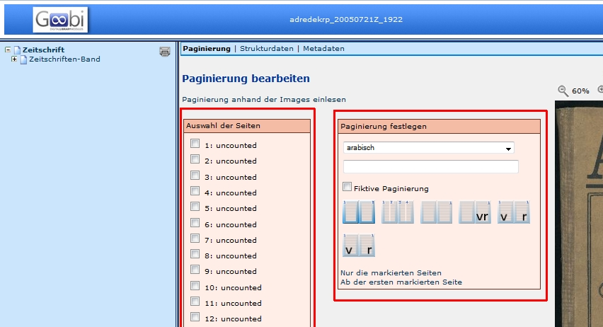
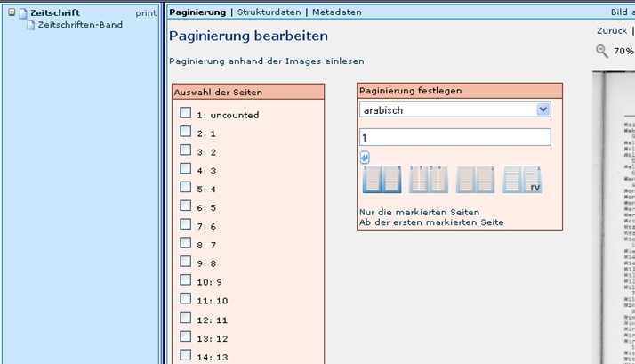
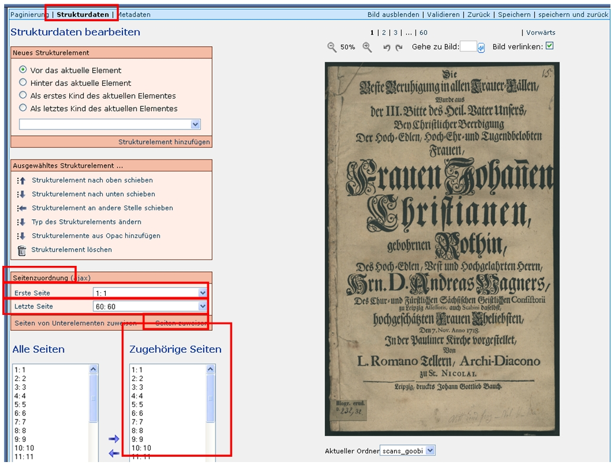

# Paginierung einlesen
Seit der Version 1.10 werden die Images automatisch eingelesen und als _uncounted_ bezeichnet. Zudem werden alle Images dem Band, beziehungsweise der Monografie als ungezählte Seite zugewiesen. 

Da dies in aller Regel nicht mit der Paginierung des Originals übereinstimmt, kann die Paginierung anhand des Originals eingegeben werden. Die Paginierung dient jedoch nur der besseren Benutzbarkeit. Technisch gesehen, kann jedem Image eine beliebige Seitenummerierung zugewiesen werden. Bevor der Ablauf an einem Beispiel demonstriert wird, werden einige allgemeine Funktionen beschrieben.

# Auswahlflächen

Die Funktionen der Paginierung sind auf zwei Felder aufgeteilt:

* *Auswahl der Seiten*
* *Paginierung festlegen*

## Auswahl der Seiten

Hier können die Images ausgewählt werden, die umbenannt werden sollen und es wird die bestehende Paginierung der Images angezeigt. Die linke Ziffer ist die Nummer des Images, die rechte Ziffer stellt die Seitenzählung des Mediums dar.

## Paginierung festlegen

Hier können unterschiedliche Funktionen genutzt werden:

* Auswahl der Zählung
	* arabisch
	* römisch
	* unnummeriert
	* Freitext
	* Für Fortgeschrittene
* Eingabe der Ziffer, mit der die Zählung beginnen soll
	* Wenn eine Seitenzählung erst mit 5 beginnt, kann hier 5 eingetragen werden.
* Auswahlbox fikitve Paginierung
	* die ausgewählte Zählung wird in eckigen Klammern dargestellt
* Seitenzählung
	* Seitenzählung
	* Spaltenzählung
	* Blattzählung
	* RectoVerso
	* Blattzählung
	* RectoVerso
	* Seitenzählung
* Auswahl der Images, die von der Zählung betroffen sind ( oder )
	* *Nur die markierten Seiten*: Zuweisung der ausgewählten Zählung auf bestimmte Images
	* *Ab der ersten markierten Seite*: Zuweisung der ausgewählten Zählung auf alle Images ab einem bestimmten Image

# Ablauf

Die verschiedenen Zählungen innerhalb einer Vorlage werden nacheinander abgebildet. Über die Funktion *Ab dem gewählten Image* kann eine neue Zählung die vorher Gewählte überschreiben.

Arbeitsschritt Paginierung ausführen:

Ungezählte Seiten am Anfang und/oder am Ende der Vorlage (Einband, Titel, sonstiges):

* Imagenummern markieren
* Paginierung festlegen: unnummeriert –> Funktion *Nur die markierten Seiten*

oder:

* erstes Image markieren
* Paginierung festlegen: unnummeriert –> Funktion *Ab der ersten markierten Seite*

Erste gezählte Seite ermitteln:

* erstes Image mit eingedruckter Seitenzählung aufblättern und in der Auswahl markieren
* Paginierung festlegen
	* Art der Zählung arabisch/römisch/Freitext
	* erste eingedruckte Seitenzahl eingeben
	* Art der Zählung: Seitenzählung/Spaltenzählung/Blattzählung/Recto-Verso
	* Funktion *Ab der markierten Seite* für Übernahme als fortlaufende Zählung

Weitere Seitenzählungen einfügen:

* oben genannten Ablauf wiederholen: Images auswählen - Paginierung festlegen - Funktion Ab der ersten markierten Seite (neu beginnende Zählung) oder Nur die markierten Seiten (zwischengeschobene, abweichende Zählung)

Abschließen der Paginierung:

* Funktion *Speichern*: Zwischenspeichern der Eingaben
* Funktion *Speichern und Zurück*: Speichern der Eingaben und Beenden der Bearbeitung des Vorgangs im Metadateneditor
* Funktion *Zurück*: Beenden der Bearbeitung des Vorgangs im Metadateneditor ohne Speichern

# Paginierung für Fortgeschrittene

Kompliziertere Paginierungen lassen sich mit der Menüfunktion _Für Fortgeschrittene_ erstellen. In einfachen Fällen verhält sich die Paginierung intuitiv, erkennt Wörter, Ziffern, groß- und kleingeschriebene römische Zahlen sowie Doppelseitenpaginierung in beiden Richtungen automatisch.

| Beispiel | Eingabe | Erwartbare Paginierung |
| --- | --- | --- |
| Ziffer in Klammern | `(4)` | (4), (5), (6), … |
| Wort und Ziffer | `Seite 1` | Seite 1, Seite 2, Seite 3, … |
| Fiktive kleine römische Zahlen | `[iii]` | [iii], [iv], [v], … |
| Spaltenzählung, teils fikitiv | `[4] [5] 6` | [4] [5] 6, [7] [8] 9, [10] [11] 12, … |
| Doppelseitenpaginierung rechts-nach-links | `3 2` | 3 2, 5 4, 7 6, … |
| Zahlen überspringen | `3 6` | 3 6, 9 12, 15 18, … |
| Gemischte Zahlentypen | `[ii] 3` | [ii] 3, [iv] 5, [vi] 6, … |

Die Schrittweite des Zählers lässt sich auch explizit durch anhängen einer hochgestellten Ziffer bestimmen. Diese lassen sich durch Buttons oder, je nach Betriebssystem und Tastatureinstellungen durch Tastenkombinationen eingeben:

| Zeichen | Schrittweite | Button | QWERTZ, Windows | Neo |
| --- | --- | --- | --- | --- |
| `°` | 0 | [+0] | <kbd>⇧</kbd> + <kbd>^</kbd> | <kbd>⇧</kbd> + <kbd>1</kbd> |
| `½` | +½ | [+½] | <kbd>Alt</kbd> + (<kbd>1</kbd>, <kbd>7</kbd>, <kbd>1</kbd>)* | <kbd>Mod3</kbd> + <kbd>Tab</kbd>, <kbd>1</kbd>, <kbd>2</kbd> |
| `¹` | +1 | [+0] | <kbd>Alt</kbd> + (<kbd>0</kbd>, <kbd>1</kbd>, <kbd>8</kbd>, <kbd>5</kbd>)* | <kbd>^</kbd>, <kbd>1</kbd> |
| `²` | +2 | [+0] | <kbd>AltGr</kbd> + <kbd>2</kbd> | <kbd>^</kbd>, <kbd>2</kbd> |
| `³` | +3 | [+0] | <kbd>AltGr</kbd> + <kbd>3</kbd> | <kbd>^</kbd>, <kbd>3</kbd> |

*) <kbd>Alt</kbd> gedrückt halten, die Ziffernfolge _auf dem Nummernblock_ eingeben, <kbd>Alt</kbd> loslassen

Das Zeichen `½` führt zur halben Schrittweite, das heißt zur doppelten Zählung (für Blattzählung). Die Eingabe `3½` erzeugt die Zählung 3, 3, 4, 4, …. Mit dem umgekehrten Fragezeichen (`¿`) wird das jeweils nachfolgende Zeichen nur auf der zwischengeschobenen Seite ausgegeben, mit dem umgekehrten Rufzeichen (`¡`) nur auf der eigentlichen Seite. Die Eingabe `1°¡r¿v½` erzeugt die Paginierung 1r, 1v, 2r, 2v, …. (Nach der 1 wird der Zähler noch nicht hochgezählt (sonst bekämen wir 1r, 2v, 4r, 5v, …), am Ende der Sequenz um ½.) Um mit einem halben Zählerstand zu beginnen, kann das `½` auch an den Anfang gestellt werden. Die Eingabe `½2°¡r¿v½` erzeugt die Paginierung 2v, 3r, 3v, …. Auch folgendes wäre möglich: `1° (¡V¡o¡r¡d¡e¡r¿R¿ü¿c¿kseite)½` erzeugt 1 (Vorderseite), 1 (Rückseite), 2 (Vorderseite), 2 (Rückseite), …

Von _Accent Graves_ umschlossener Text (z.B. `` `mil.` ``, MIL ≙ 1049) wird als Text verstanden. Dies kann eingesetzt werden, um die Unterseitenzählung enthaltener Werke zu generieren.

**Beispiel:** In einer Publikumszeitschrift ist auf Seite [26] ein elfseitiger Werbeträger eingeklebt (die Rückseite des Werbeträgers ist vollflächig verklebt). Erreicht werden soll folgende Paginierung:

* …
* 25
* ([26] - [1])
* ([26] - 2 3)
* ([26] - 4 5)
* ([26] - 6 7)
* ([26] - 8 9)
* ([26] - 10 11)
* 27

Während die Zeile `([26] - [1])` am einfachsten durch Freitexteingabe erstellt wird, wäre es schön, die folgenden Zeilen automatisch erzeugen zu lassen. Dies kann durch eingabe des folgenden Textes in das Feld erreicht werden: ``([`26` - 2 3)``. 

Die Paginierung für Fortgeschrittene kann über den Konfigurationsparameter `advancedPaginationEnabled=false` ausgeschaltet werden, falls dieses erforderlich ist.

# Weitere Informationen
Tutorial: [Paginierung definieren](https://github.com/kitodo/kitodo-tutorials/blob/master/kitodo2/07_paginierung-definieren.md)