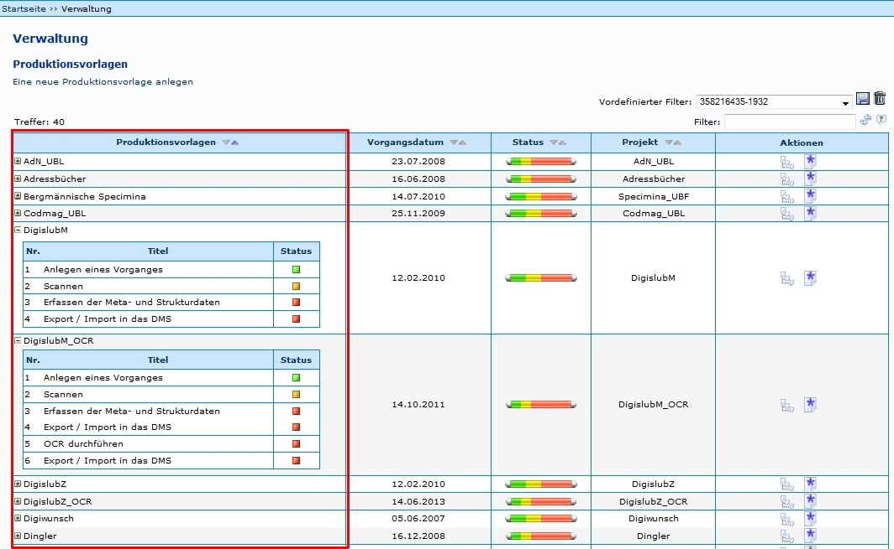

# Produktionsvorlage
Eine Produktionsvorlage ist ein vorgefertigtes Muster, das alle geplanten [Aufgaben](Aufgaben.md) in einer definierten Reihenfolge (zum Beispiel: Anlegen, Scannen, Metadaten, OCR, Export) enthält. Wenn ein Titeldatensatz eines Digitalisats importiert wird, werden diesem automatisch alle Aufgaben in dieser Reihenfolge zugeordnet. Man erspart sich hierdurch das Zusammenstellen der verschiedenen Aufgaben bei jedem neuem Titel. Das Produkt ist der sogenannte Vorgang.

Einer Produktionsvorlage muss immer ein [Projekt](Projekt.md) zugewiesen werden. Diesem Projekt werden alle Vorgänge zugeordnet, die mit der Vorlage angelegt werden. Weitere Informationen zur Bearbeitung, bzw. Erstellen von Produktionsvorlagen finden sich unter [Bearbeitung Produktionsvorlage](Bearbeitung-Produktionsvorlage.md).

# Beispiel
Hier ist ersichtlich, dass eine Produktionsvorlage aus mehreren Aufgaben besteht und einem Projekt zugeordnet ist.

# Weitere Informationen
* Tutorial: [Produktionsvorlage anlegen und Workflow definieren](https://github.com/kitodo/kitodo-tutorials/blob/master/kitodo2/04_produktionsvorlage-anlegen-und-workflow-definieren.md)