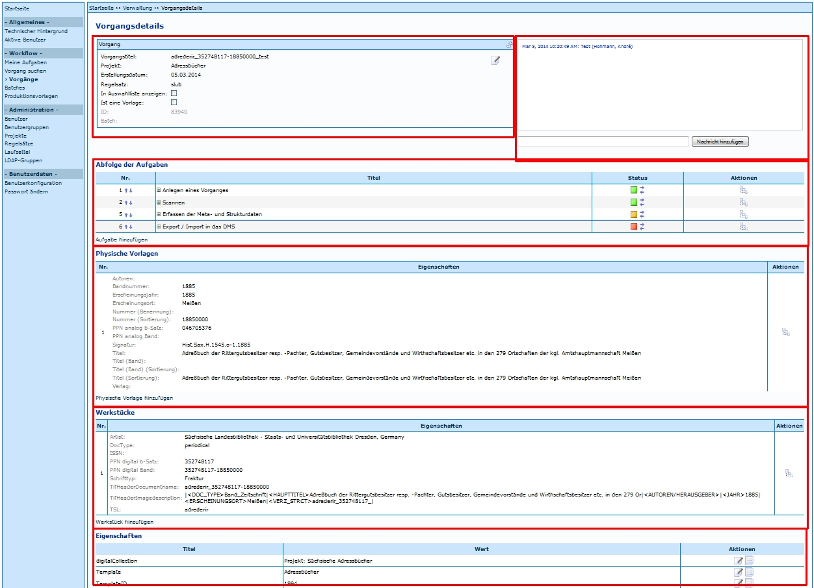

# Vorgangsdetails

Unter Vorgangsdetails werden in Kitodo.Production administrative Angaben zu einem Vorgang zusammengefasst. Die Informationen werden in der Datenbank gespeichert; nicht in den Metadaten des Digitalisats.  

Dies beinhaltet folgende Bereiche, die zum besseren Verständnis in einer Grafik hervorgehoben sind: 

 

## [Vorgang]

Dieser Bereich hat keinen eindeutigen Titel. Er enthält folgende Angaben: 

* Projekt
* Regelsatz
* Vorgangstitel
* ID

Diese Angaben (bis auf ID) können hier geändert werden. Außerdem kann der  Vorgang hier gelöscht werden.

 
## [Nachrichtenbox]

Dieser Bereich hat keinen eindeutigen Titel. In diesem Feld werden Informationen angezeigt, die beim Anlegen eines Vorgangs, bei Korrekturmeldungen oder anderen Arbeitsschritten eingetragen werden. 

 
## Abfolge der Aufgaben

Hier werden die Aufgaben mit Statusangabe angezeigt. Diese Angaben können hier auch bearbeitet werden. Dazu zählt:

* Letzte Bearbeitung anzeigen lassen
* Status ändern
* Abfolge ändern 
* unter Details der Aufgabe:
	* Löschen des Schritts 
	* Benutzer hinzufügen
	* Benutzergruppen hinzufügen 
* und einiges Weiteres...

 
## Physische Vorlagen

In diesem Bereich werden Metadaten über die Vorlage des Digitalisats gespeichert. Weitere Informationen finden sich unter Physische Vorlagen - Vorlageneigenschaft.

 
## Werkstücke

In diesem Bereich werden Metadaten über die Vorlage des Digitalisats gespeichert. Weitere Informationen finden sich unter Werkstücke - Werkstückeigenschaft.

 
## Eigenschaften

Diesen Bereich gab es bis zur Version 1.7.x nicht. In diesem Bereich befinden sich unterschiedliche Informationen. Aus Sicht der SLUB lassen sich durch die Migration von der Version 1.7.x bis 1.10.x folgende Aussagen treffen:

Bei Vorgängen, die aus älteren Versionen migiriert wurden, sind zumeist keine Daten vorhanden. Ge­ge­be­nen­falls werden Informationen zu Korrekturen hier abgelegt.

Bei Vorgängen, die in der Version 1.10 angelegt wurden, werden folgende Angaben zu einem Vorgang gespeichert:

* digitalCollection (Kollektion)
* Template (Produktionsvorlage)
* TemplateID (ID der Produktionsvorlage)

Sollten bei einem Versionswechsel diese Angaben nicht migriert werden, ist eine Recherche dieser Felder nicht zu empfehlen, da die Treffermenge womöglich nicht der gesamten Menge des Gesuchten entspricht.

**Achtung**: Wird der Titel (oder andere Metadatenfelder) eines Vorgangs in den Metadaten (XML-Datei) geändert, wird er an in den Vorgangsdetails nicht automatisch korrigiert! Somit kann es sein, dass die Angaben dieser Felder von denen in den Metadaten (XML-Datei) in der abweichen.

# Weitere Informationen
* Tutorial: [Vorgänge anlegen](https://github.com/kitodo/kitodo-tutorials/blob/master/kitodo2/05_vorgaenge-anlegen.md)